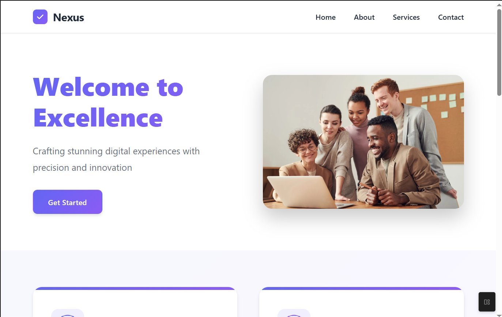
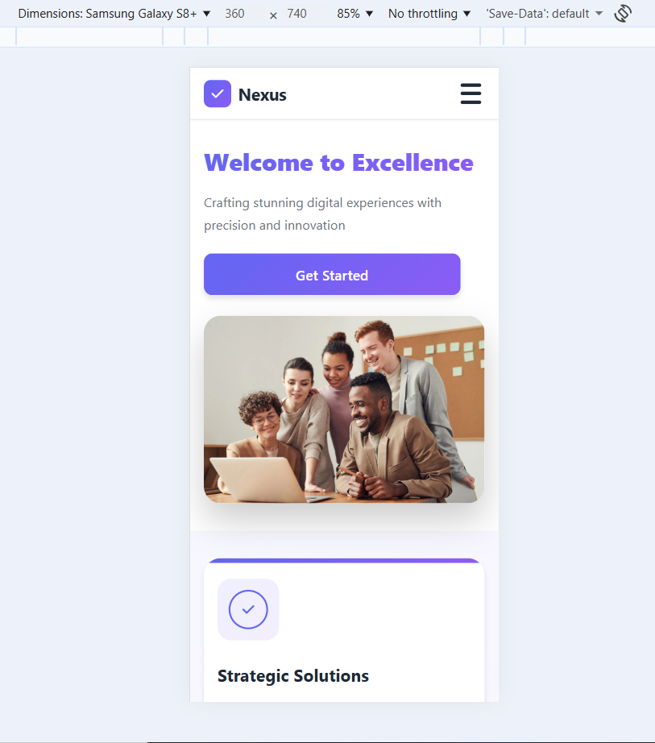

# 📱 mobile-easy - Responsive Website

Make any website mobile-friendly using **CSS Media Queries**.

---
## 🎯 Objective

Convert a desktop-only web page into a fully **mobile-friendly** layout using media queries.

---
## 📷 Screenshots

Add before/after screenshots of your page in desktop and mobile views to `assets/` folder:

| Desktop View                | Mobile View                  |
|-----------------------------|------------------------------|
|  |    |

---
📂 Project Structure

```
mobile-easy/
│
├── assets/
|   ├── desktop.png
|   └── mobile.png
├── index.html
└── style.css
```
## Features
- Mobile-first responsive design
- Flexible images and text
- CSS media queries for max-width: 768px
- Works on all modern browsers

---
## ⚙️ Setup Instructions

1. **Clone the repository**  
git clone https://github.com/your-username/todo-app.git

2. **Open the project folder**  
cd mobile-easy

3. **Launch in VS Code** and install the **Live Server** extension if needed.

4. **Run the project:**  
- Right-click on `index.html` and choose **“Open with Live Server”**  
- The app loads in your default browser.

---

## 🛠️ Tools Used

- HTML & CSS (any HTML file)
- VS Code (or any code editor)
- Chrome DevTools (Device Toolbar)

---

## 📝 License

MIT License.  
Use, modify, and distribute for educational purposes.

---

## 👩‍💻 Author

**Devi Patil**

---

